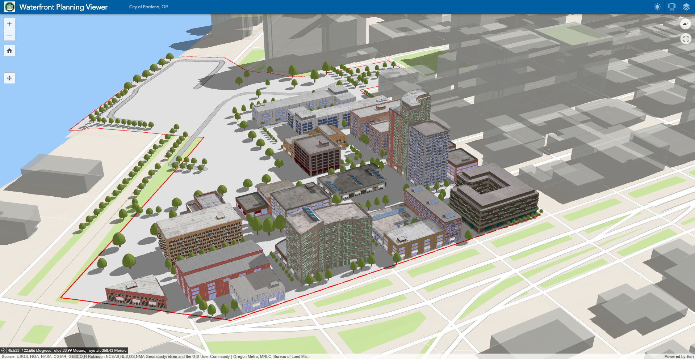
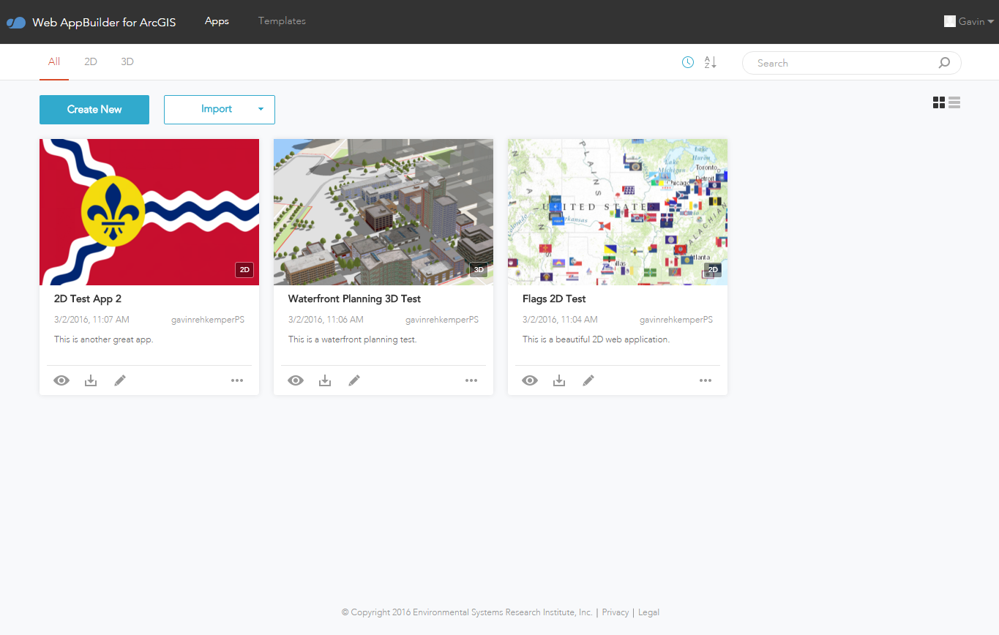
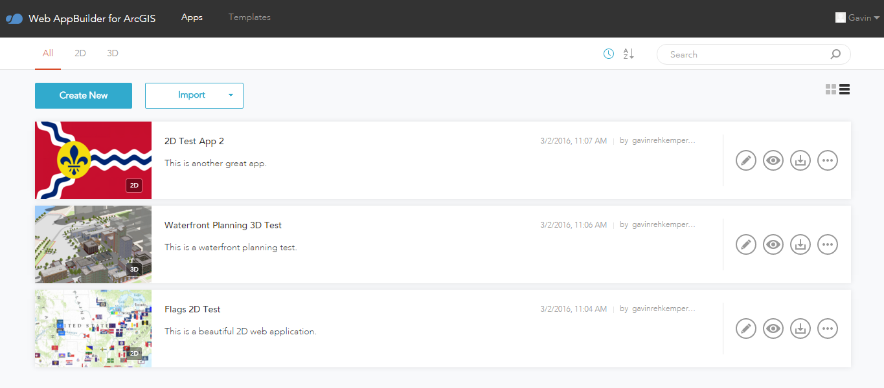

<!-- .slide: data-background="reveal.js/img/bg-4.png" -->
## What is Web AppBuilder?

---

## Builder Experience

Note: Brings "builder" experience from Flex/Silverlight to JavaScript

---

## When to use Web AppBuilder

- Good for:
  - Multi-purpose apps that need to run on multiple devices
  - Creating a suite of custom apps with consistent style/behavior
  - Empowering non-devlopers to create apps
- Other frameworks/templates might be better for:
  - Specific, custom web apps, with specialized workflows
  - When there is a template that does almost all of app functionality

---

## What's new in WAB 2.0 Beta

---

---

